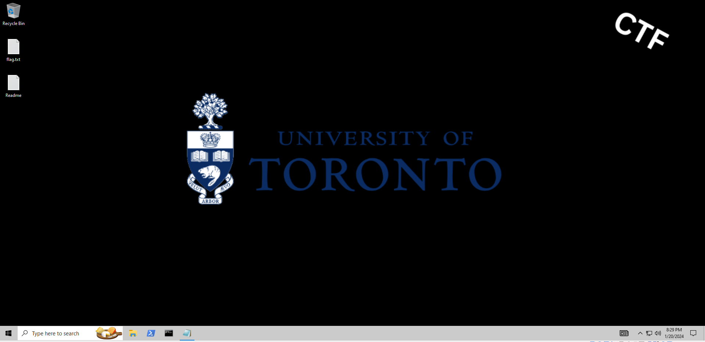
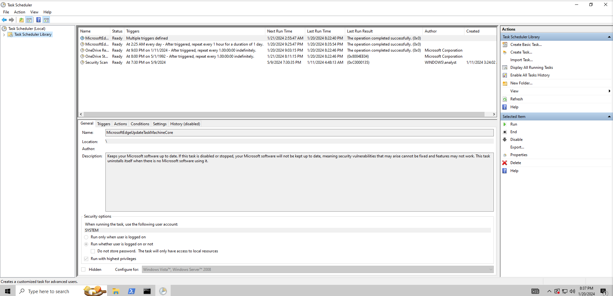
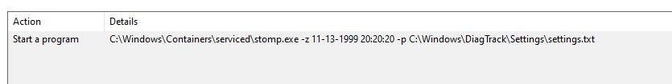

### Hourglass

Category: **Forensics**

Once we download the vm and import it to virtualbox, we can start solving the challenge.

Browsing around the Desktop, we are greeted with 2 files `Readme.txt and flag.txt`, the readme contains the backstory of the challenge and flag.txt which has a fake flag inside of it. 

If we take a note of the challenge name, it becomes clear that the challenge has something to do with **`time`**.

Knowing that this is a forensics challenge we first can check out a utility that windows offers which is called **Task Scheduler**. For people who are not sure what it is, essentially its used to schedule tasks, very similar to how cron jobs work in *unix.

Checking out the tasks that are scheduled to run, we can quickly notice a weird task called `Security Scan`, if we inspect the task and see the Actions of it, there seems to be an odd command running using an executable called "stomp.exe". Not normal at all.

There is also one more file provided in the commnad which is located @ *C:\Windows\DiagTrack\Settings\settings.txt*

`Ky0tCiB1b2Z0Y3Rme1Q0c0tfU2NoM0R1bDNyX0ZVTn0KKy0t`

Going to that file and opening it yields a base64 string, which when decoded should give us the flag.

**uoftctf{T4sK_Sch3Dul3r_FUN}**
