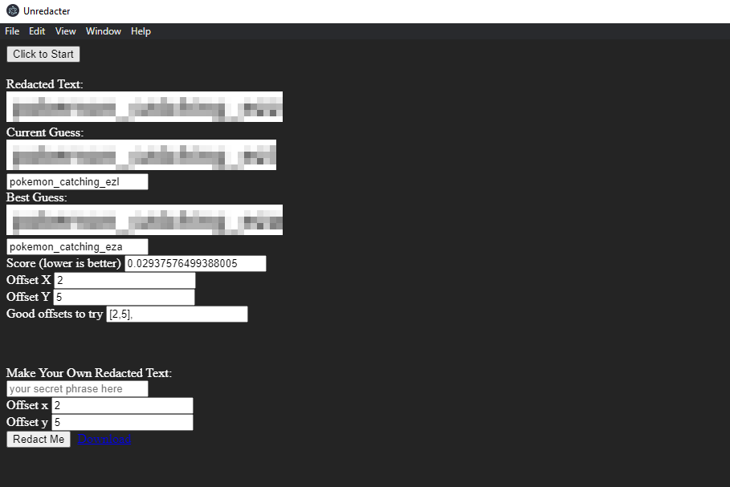

Crop the image, then use [unredacter](https://github.com/bishopfox/unredacter) to decode the pixels into plaintext. Ensure that you modify the program to use the correct character set:

```ts
const guessable_characters = 'abcdefghijklmnopqrstuvwxyz_ ';
```

# Output



The program gets the last character of the flag wrong, `a` instead of `z`. However, you can verify the last character is `z` by using the "Make Your Own Redacted Text" feature and comparing the output with the original image. All that's left is to wrap the output in `uoftctf{}`.

# Flag

`uoftctf{pokemon_catching_ezz`