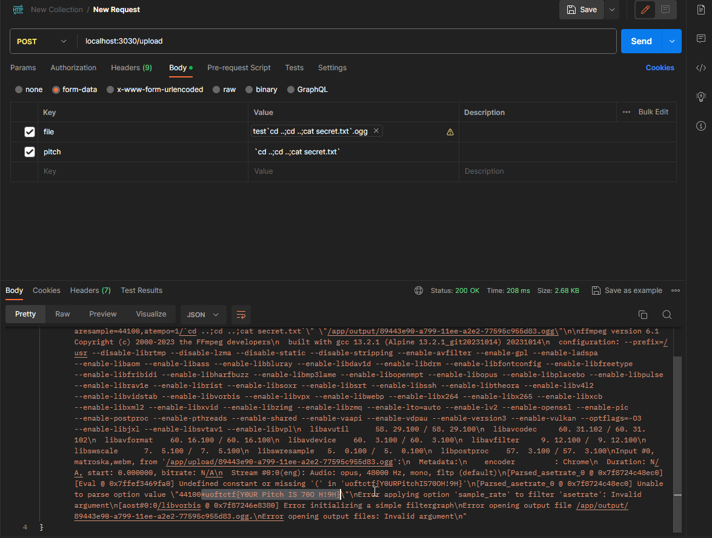

Issue a post request (using a software like postman) with any audio but setting the value of pitch to `` `cd ..;cd ..;cat secret.txt` ``, this will reveal the flag in the output.
This pitch value opens a subshell (using the \` syntax) which finds the flag. Note that to find the location of `secret.txt` you can inject commands like `ls`.